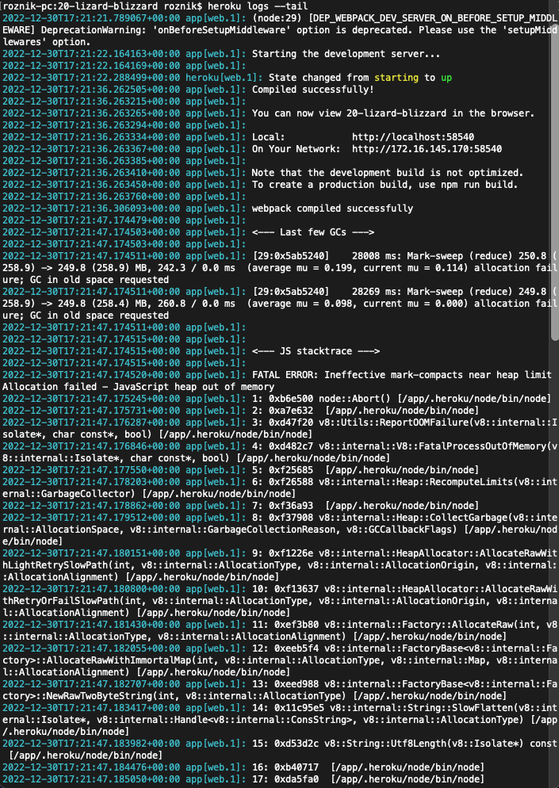
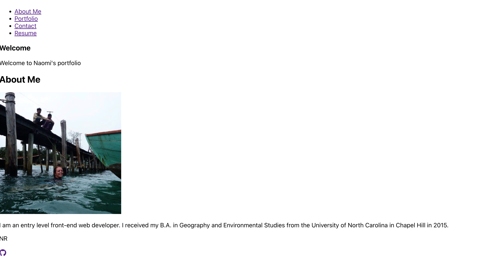
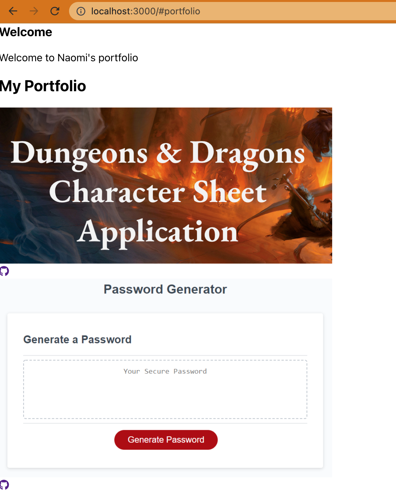
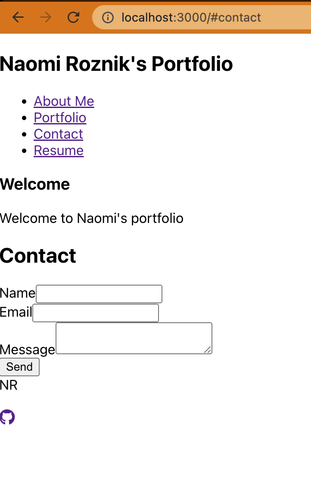
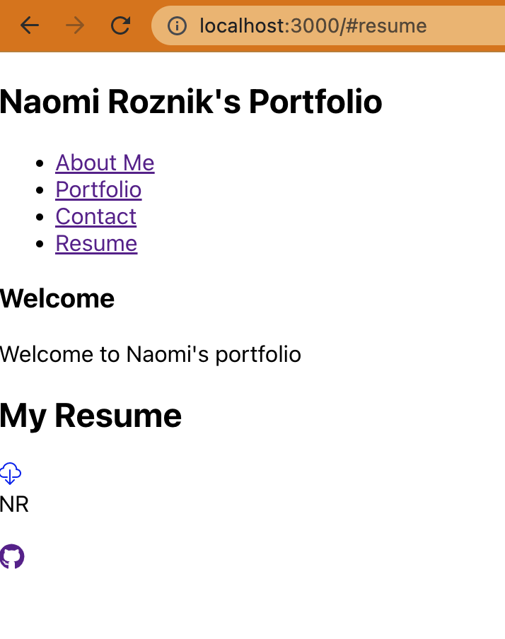
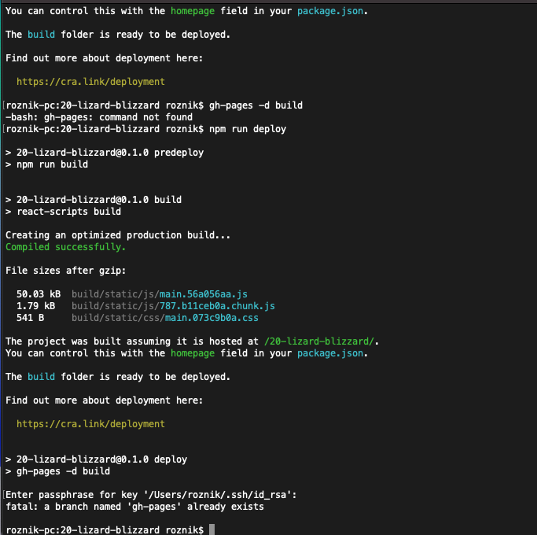

# Getting Started with Create React App

## Description

This project was bootstrapped with [Create React App](https://github.com/facebook/create-react-app).

[View my unsuccessful deployment here.](https://n-roz.github.io/attempt-6-on-20/)

I actually started to like this project! I learned a lot. My portfolio is unfinished (I cannot get it to deploy on GH Pages and no styling). I am submitting this in the hope of getting some partial credit. I will be styling this later to use as my portfolio for job searching.

This is a new repo I created while trying to deploy. My old repo is [here.](https://github.com/n-roz/20-lizard-blizzard)

See my ```heroku logs --tail``` below for an insight into my deployment errors.



## Mockup











## Grading Requirements
```
Technical Acceptance Criteria: 40%
Satisfies all of the preceding acceptance criteria plus the following:
Yes - Application must use React to render content.
Yes - Application has a single Header component that appears on multiple pages, with a Navigation component within it that’s used to conditionally render About Me, Portfolio, Contact, and Resume sections.
Yes - Application has a single Project component that’s used multiple times in the Portfolio section.
Yes - Application has a single Footer component that appears on multiple pages.
It's deployed with errors but technically yes - Application must be deployed to GitHub Pages.

Deployment: 32%
Maybe if you are generous - Application deployed at live URL.
No - Application loads with no errors.
Yes? - Application GitHub URL submitted.
Yes - GitHub repository contains application code.

Application Quality: 15%
Yes - User experience is intuitive and easy to navigate.
Probably not - User interface style is clean and polished.
Technically yes - Application uses a color scheme other than the default Bootstrap color palette.

Repository Quality: 13%
Yes - Repository has a unique name.
Yes - Repository follows best practices for file structure and naming conventions.
Yes - Repository follows best practices for class/id naming conventions, indentation, quality comments, etc.
Yes - Repository contains multiple descriptive commit messages.
Yes - Repository contains high-quality README file with description, screenshot, and link to deployed application.
```      

## Available Scripts

In the project directory, you can run:

### `npm start`

Runs the app in the development mode.\
Open [http://localhost:3000](http://localhost:3000) to view it in your browser.

### `npm test`

Launches the test runner in the interactive watch mode.\
See the section about [running tests](https://facebook.github.io/create-react-app/docs/running-tests) for more information.

### `npm run build`

Builds the app for production to the `build` folder.\
It correctly bundles React in production mode and optimizes the build for the best performance.

See the section about [deployment](https://facebook.github.io/create-react-app/docs/deployment) for more information.

### `npm run eject`